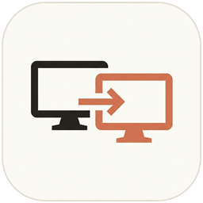

<p align="center">
  
</p>

<h1 align="center">AeroDesk — Standalone Windows Remote Desktop (<code>AeroDesk.exe</code>)</h1>

<p align="center">
  <a href="https://github.com/oocs07/Remote-Desktop/releases/latest"><strong>⬇ Download Latest Release (<code>AeroDesk.exe</code> v2.0.1)</strong></a>
</p>

AeroDesk is a zero-install, hardware-accelerated Remote Desktop application for Windows distributed as a single portable executable (**`AeroDesk.exe`**). Built with **C++20** and hand-tuned **x86-64 AVX2 SIMD Assembly**, it delivers ultra-low-latency remote screen sharing, input control, clipboard synchronization, chunked file transfer, and live encrypted chat using a **9-Digit Desk ID** (`XXX XXX XXX`) and password or interactive approval.

---

## Architecture Overview

| Layer / Component | Language & Technology | Purpose & Measured Impact |
| :--- | :--- | :--- |
| **Standalone Desktop App (`AeroDesk.exe`)** | **C++20** (Win32, Direct2D, DirectWrite, DXGI, Windows CNG) | Single-file portable Host & Viewer GUI with White & Blue / Black & Blue themes, VSync-locked animations, and GPU screen capture. |
| **SIMD Hot-Loop Kernels (`src/simd/`)** | **x86-64 AVX2 Assembly (`.S`)** | 256-bit `ymm` vector instructions (`vmovdqu`, `vpcmpeqb`, `vpmovmskb`, `vpxor`) for 64×64 dirty-tile hashing/diffing (**~80 GB/s, ~20× faster than scalar C++**) and stream cipher XOR. |
| **Dedicated Relay Server (`relay-dotnet/`)** | **C# / .NET 10 (`AeroDeskRelay`)** | Optional headless `async/await` Rendezvous & TCP Bridge server for cross-subnet 9-digit Desk ID routing. |
| **Benchmark & Stress Harness (`scripts/`)** | **Python 3.14 (`benchmark_suite.py`)** | Automated verification and stress-testing harness for SIMD throughput and Relay concurrency. |

---

## Key Features in v2.0.1

### Remote Display & Administration Suite
- **Multi-Monitor Switching (`MONITOR_LIST` & `MONITOR_SELECT`)**: Seamlessly enumerate all host physical displays with native resolutions, and switch active display live with normalized mouse cursor mapping.
- **Remote Admin Suite**: Execute remote `LockWorkstation()`, `ShowDesktop` (`Win+D`), `Task Manager / Security Desktop` (`sas.dll` / `taskmgr.exe`), and `Emergency Reboot` (`ExitWindowsEx`).
- **Live Quality & FPS Switching**: Dynamically toggle between Ultra / Balanced / Low Bandwidth and 60 / 30 / 15 FPS targets mid-session without stream interruption.
- **Clipboard Sync Toggle**: One-click mute/unmute of bidirectional clipboard text syncing with instant toast confirmation.

### Engine Resilience & Auto-Recovery
- **DXGI `ACCESS_LOST` Instant GDI Fallback**: When UAC prompts, display resolution changes, or GPU mode switches invalidate DXGI Desktop Duplication, AeroDesk bridges to GDI capture with zero dropped frames, attempting non-blocking DXGI re-initialization every 500ms.
- **In-Session Client Auto-Reconnect**: Automatic 3-attempt backoff reconnect loop (1s, 3s, 5s) preserving the decoded remote desktop canvas and cryptographic credentials across network drops or router reconnects.

### Direct2D UI/UX Pro Max Modernization
- **Borderless Fullscreen (`F11`)**: Seamless borderless fullscreen covering active monitor bounds.
- **macOS Dynamic Island Floating Top Bar**: In fullscreen mode, moving the cursor to the top edge smoothly glides down a floating Dynamic Island capsule pill powered by second-order spring physics (`stepSpring`), featuring live session indicators, Display switcher, Admin dropdown, Quality toggles, and pin dock.
- **Keyboard Shortcuts Cheat Sheet (`F1` / `?`)**: Centered translucent acrylic modal showcasing all hotkeys (`F11`, `F1`, `F8`, `Ctrl+Alt+[1-9]`, `Ctrl+Alt+L`, `Ctrl+Alt+D`, `Ctrl+Alt+Del`).
- **White & Blue / Black & Blue Themes**: Instant runtime switching between **Crisp White & Royal Blue (`#2563EB`)** and **Pitch Black & Electric Blue (`#3B82F6`)** palettes.
- **VSync-Locked Smooth Animations**: QPC-driven Direct2D hardware VSync animation loop with zero-overhead native OS cursor handling.

---

## How to Use

### 1. Run `AeroDesk.exe`
Download **`AeroDesk.exe`** from [**GitHub Releases**](https://github.com/oocs07/Remote-Desktop/releases/latest) (or run it directly from the repository root):
```powershell
.\AeroDesk.exe
```
To run multiple isolated instances on the same PC for local testing:
```powershell
.\AeroDesk.exe --instance 1
.\AeroDesk.exe --instance 2
```

### 2. Connect to a Remote Desk
1. On the **Host PC**, copy the **9-Digit AeroDesk Address** (`XXX XXX XXX`) and the **6-Character One-Time Session Code** (or configure a permanent unattended password).
2. On the **Viewer PC**, enter the Host's 9-digit ID (or click a discovered LAN Desk card), enter the password/code (or leave blank to request interactive approval on the Host), and click **Connect to Desk**.

---

## Building & Testing from Source

### Prerequisites
- **Windows 10 / 11 (x64)**
- **MSYS2 MinGW-w64 UCRT64 (`g++` & GNU Assembler `as`)** with static `libzstd`

### Build & Verification Commands
```powershell
# Compile standalone AeroDesk.exe (C++20 + x86-64 AVX2 Assembly)
powershell -ExecutionPolicy Bypass -File .\build.ps1

# Compile and run all 106 automated assertions in AeroDeskTests.exe
powershell -ExecutionPolicy Bypass -File .\build.ps1 -Test

# Run full build, test suite, and Python benchmark harness
powershell -ExecutionPolicy Bypass -File .\build.ps1 -Test -Benchmark
```

---

## Project Structure

```text
├── AeroDesk.exe                         # Standalone portable Windows executable (C++20 + AVX2 ASM)
├── build.ps1                            # PowerShell build & verification script
├── src/
│   ├── main.cpp                         # WinMain entry point & CLI argument parser
│   ├── simd/
│   │   ├── simd_kernels.hpp             # CPUID AVX2 detection & extern "C" assembly declarations
│   │   └── simd_kernels.S               # x86-64 AVX2 SIMD assembly (tile diff, hash & stream cipher XOR)
│   ├── core/
│   │   ├── protocol.hpp                 # Wire protocol headers, opcodes, FPS & permission types
│   │   └── crypto_identity.hpp/.cpp     # 9-digit Desk ID, Windows CNG SHA-256, AVX2 stream cipher, INI
│   ├── capture/
│   │   └── screen_capture.hpp/.cpp      # DXGI Desktop Duplication, GDI fallback, Zstd/JPEG tile codec
│   ├── control/
│   │   ├── input_injector.hpp/.cpp      # Win32 SendInput mouse/keyboard injection & modifier release
│   │   └── clipboard_file_manager.hpp/.cpp # Clipboard sync & chunked file transfer with CNG SHA-256
│   ├── net/
│   │   └── network_engine.hpp/.cpp      # UDP LAN discovery, TCP Relay, E2EE session & rate limiter
│   └── ui/
│       └── ui_window.hpp/.cpp           # Direct2D / DirectWrite UI, custom cursor & spring animations
├── relay-dotnet/
│   ├── AeroDeskRelay.csproj             # Optional C# .NET 10 Headless Rendezvous & Relay Server
│   └── Program.cs                       # Async TCP Relay & self-test implementation
├── scripts/
│   └── benchmark_suite.py               # Python 3.14 benchmark & stress verification suite
└── tests/
    └── test_suite.cpp                   # Automated C++20 + AVX2 integration test suite (106 assertions)
```

---

## License

Licensed under the [MIT License](LICENSE). Copyright (c) 2026 oocs07.
